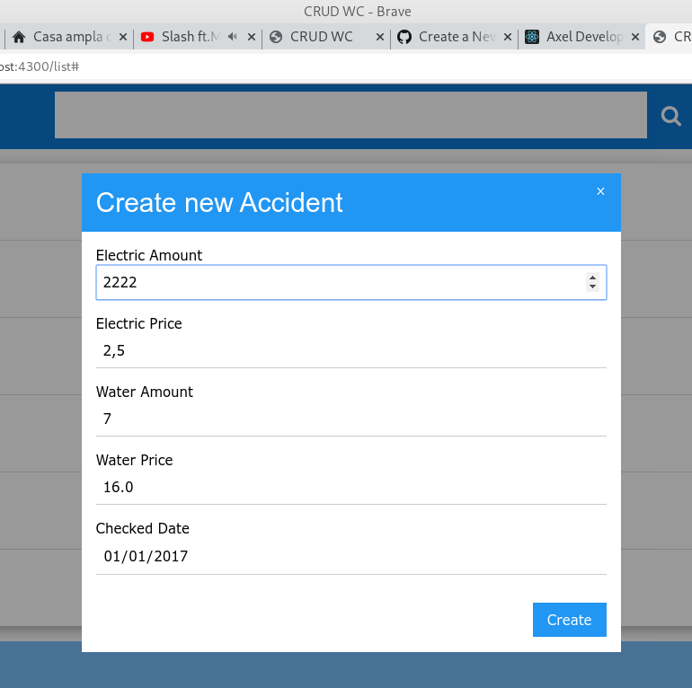
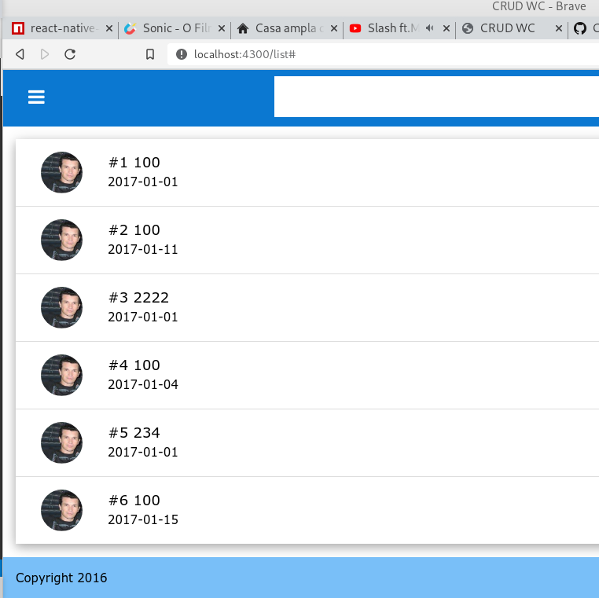

[](https://travis-ci.org/axeldeveloper/go-crud-sqlite)

# Project - gocrud
Sample CRUD use Go with sqlite

# Introduction
This sample aim to practice while I'm learning Go, It use built-ins Go's packages such as `net/http`, `database/sql`, `strconv`, 
`html/template` and use a third party packge https://github.com/mattn/go-sqlite3

# Basic usage
`docker run --publish 8898:3333 --name go-crud-sqlite --rm axeldeveloper/go-crud-sqlite`


# Advance usage
- Setup environment official here https://golang.org/doc/install
- Clone and change to `go-crud-sqlite` folder ren run `go get` to install dependencies.
- Create table 
```sql
CREATE TABLE cost
(
    id INTEGER PRIMARY KEY NOT NULL,
    electric_amount INTEGER,
    electric_price INTEGER,
    water_amount INTEGER,
    water_price INTEGER,
    checked_date TEXT
);
```

# rum project

- Run local `go run *.go`
- Docker build `docker build -t go-crud-sqlite .`
- Docker run `docker run --publish 8898:3333 --name go-crud-sqlite --rm go-crud-sqlite`
- go run utils.go models.go handlers.go main.go

# Screen shots



